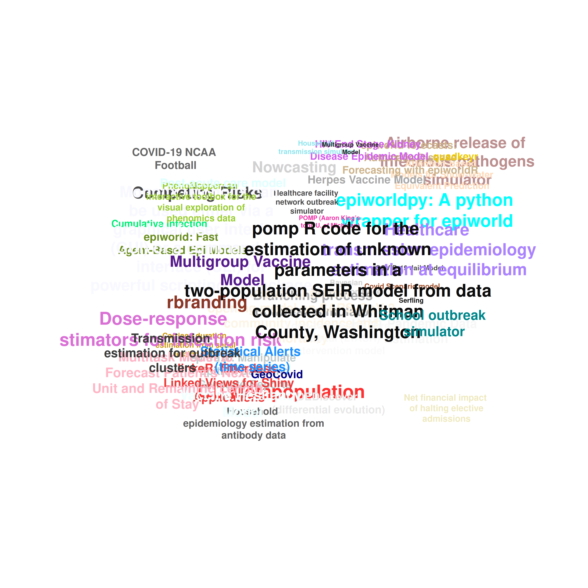

# Software development coordination

This repository is used for coordinating all the software development
activities by the ForeSITE group.

The list includes 39 tools. A complete list featuring completed and
work-in-progress tools holds 54 entries. We will be updating this list
as we progress.

|     | Type                                                      |   N |
|:----|:----------------------------------------------------------|----:|
| 3   | Epidemic Model - Scenario Modeling                        |  19 |
| 6   | Parameter estimation                                      |  12 |
| 4   | Epidemic Model - Scenario Modeling & Parameter estimation |   2 |
| 1   | Decision Support tool                                     |   1 |
| 2   | Epidemic Model - Forecasting                              |   1 |
| 5   | Nowcasting tool                                           |   1 |
| 7   | Statistical Model - Forecasting                           |   1 |

Number of software packages by type

| Language |   N |
|:---------|----:|
| r        |  19 |
| Other    |  11 |
| python   |   7 |
| c++      |   3 |
| anylogic |   2 |
| matlab   |   2 |
| sas      |   2 |
| stata    |   2 |

Number of software packages by programming language.

# Existing software packages

List of existing software packages that are being used by the ForeSITE
group. This list was last updated on 2024-11-05.

| N | Tool | Description |
|---:|:---|:---|
| 1 | Airborne release of infectious pathogens simulator (R) | Estimate airborne dispersal, human exposure, and infection probabilities and timelines after a release of a quantity of infectious organisms. Scenarios(s) Modeled: Airborne release and human inhalational exposure and infection, similar the Sverdlovsk anthrax leak of 1979. ([Learn more…](profiles.md#airborne-release-of-infectious-pathogens-simulator))  |
| 2 | Attention-Based Models for Snow-Water Equivalent Prediction (Python) | Transformer architectures for spatio-temporal prediction (or synthetic data generation/imputation). Scenarios(s) Modeled: Predicting the SWE value for multiple SNOTEL locations in the Western US using the Attention Models ([Learn more…](profiles.md#attention-based-models-for-snow-water-equivalent-prediction)) **GitHub:**  |
| 3 | Bayesian Transmission Model (C++) | Provides estimates for critical epidemiological parameters that characterize the spread of bacterial pathogens in healthcare settings. Parameter estimated: Transmission rate (frequency-dependent or density-dependent mass action), importation probability, clearance rate (loss of colonization per colonized person per unit time), surveillance test sensitivity, surveillance test specificity, effect of covariate on transmission (multiplier in relation to overall transmission rate). ([Learn more…](profiles.md#bayesian-transmission-model)) **GitHub:**  |
| 4 | Branching process outbreak simulator (R) | Quantifies risk posed by individual importers of a novel transmissible pathogen to a generic population, with intervention effects. Scenarios(s) Modeled: Novel introduction of transmissible pathogen by infected traveler, by accidentally infected laboratory worker, or similar scenario; intervention scenarios for improved detection of initial case and for delayed mitigation after ongoing outbreak is detected. ([Learn more…](profiles.md#branching-process-outbreak-simulator)) **GitHub:**  |
| 5 | Carriage duration estimation from serial testing data (R) | Estimate the duration and heterogeneity of individuals’ colonization episodes for organisms of interest. Parameter estimated: Average and distribution of clearance rate(s) across multiple candidate model forms, average (re)acquisition rate, sensitivity/specificity of testing. Estimates derived via maximum likelihood techniques. ([Learn more…](profiles.md#carriage-duration-estimation-from-serial-testing-data))  |
| 6 | Competing Risks (SAS) | Estimating a competing risks mixture model, which provides both the odds ratio of one event occurring vs. another as well as a marginal estimate of the time to both respective events. Parameter estimated: Odds ratio of two different events occurring and the time to event estimate for both events. ([Learn more…](profiles.md#competing-risks))  |
| 7 | COVID-19 Jail Model (R) | Deterministic model of a stylized jail, with a number of potential interventions developed in collaboration with the ACLU. Scenarios(s) Modeled: Decarceration, social distancing, targeted or widespread arrest reduction, isolation. ([Learn more…](profiles.md#covid-19-jail-model)) **GitHub:**  |
| 8 | COVID-19 NCAA Football (Python) | Stochastic representation a season of on-campus football during COVID. Scenarios(s) Modeled: Estimates a football season with high or low mixing between the visiting community and the hosting college student population, and with high or low prevalence in the visitors. ([Learn more…](profiles.md#covid-19-ncaa-football)) **GitHub:**  |
| 9 | Covid Scenario model (R) | A flexible scenario modeling pipeline that could quickly tailor models for decision makers seeking to compare projections of epidemic trajectories and healthcare impacts from multiple intervention scenarios in different locations. Scenarios(s) Modeled: Mask, social distance, lock down, comprehensive test/isolate, fatiguing interventions ([Learn more…](profiles.md#covid-scenario-model)) **GitHub:**  |
| 10 | CU Metapopulation (Python) | Stochastic representation of an ICU in a tertiary care academic medical center. Scenarios(s) Modeled: Staffing changes, cohorting (with some effort), decolonization, fecal transplant, antibiotic stewardship (with some modifications). Others are possible. ([Learn more…](profiles.md#cu-metapopulation)) **GitHub:**  |
| 11 | Cumulative infection (R, SAS) | We’ve used Mortality Mapping (mMAP), an existing epidemiologic and statistical analysis approach by Lu et al. \[1,2\] to estimate the cumulative incidence of symptomatic COVID-19 in Veterans in the United States. mMAP is a time series deconvolution method which infers the true COVID-19 case counts from reported COVID-19 deaths. It uses symptom onset to death distribution, smoothed time series of reported COVID-19 deaths, and symptomatic case fatality rate (sCFR) to estimate the distribution of symptomatic COVID-19 cases. We focus on the adjusted version of the mMAP approach presented by Lu et al., which tries to account for the unreported COVID-19 deaths. While Lu uses excess influenza and pneumonia deaths to account for unreported COVID-19 deaths, we have extended their approach by using excess all-cause deaths.  ([Learn more…](profiles.md#cumulative-infection))  |
| 12 | DEDiscover (differential evolution) (Kotlin, C++.) | Parameter estimation using differential evolution. ([Learn more…](profiles.md#dediscover-differential-evolution))  |
| 13 | Dose-response estimators for infection risk (R) | Estimate infection probability from a given dose of exposure using data sets from experimental dose-quantified exposures of humans or animals; model-based results used to perform quantitative risk assessment for potential human exposure scenarios. Parameter estimated: Per-unit-dose infection probability and associated additional parameters for more complicated dose-response models, including those that quantify dose-dependent latent/incubation period; can convert estimates to common “infectious dose” quantification metrics such as “ID-50.” Estimates derived via maximum likelihood for multiple equation-based dose-response models fit to exposure-response data. ([Learn more…](profiles.md#dose-response-estimators-for-infection-risk))  |
| 14 | epiworld: Fast Agent-Based Epi Models (R, C++, Python, Webessembly) | A flexible framework for Agent-Based Models (ABM), the ‘epiworldR’ package provides methods for prototyping disease outbreaks and transmission models using a ‘C++’ backend, making it very fast. It supports multiple epidemiological models, including the Susceptible-Infected-Susceptible (SIS), Susceptible-Infected-Removed (SIR), Susceptible-Exposed-Infected-Removed (SEIR), and others, involving arbitrary mitigation policies and multiple-disease models. Users can specify infectiousness/susceptibility rates as a function of agents’ features, providing great complexity for the model dynamics. Furthermore, ‘epiworldR’ is ideal for simulation studies featuring large populations. ([Learn more…](profiles.md#epiworld-fast-agent-based-epi-models)) **GitHub:**  |
| 15 | epiworldpy: A python wrapper for epiworld (Python) | A flexible framework for Agent-Based Models (ABM), the ‘epiworldR’ package provides methods for prototyping disease outbreaks and transmission models using a ‘C++’ backend, making it very fast. It supports multiple epidemiological models, including the Susceptible-Infected-Susceptible (SIS), Susceptible-Infected-Removed (SIR), Susceptible-Exposed-Infected-Removed (SEIR), and others, involving arbitrary mitigation policies and multiple-disease models. Users can specify infectiousness/susceptibility rates as a function of agents’ features, providing great complexity for the model dynamics. Furthermore, ‘epiworldR’ is ideal for simulation studies featuring large populations. ([Learn more…](profiles.md#epiworldpy-a-python-wrapper-for-epiworld)) **GitHub:**  |
| 16 | GeoCovid (R) | Shiny App for visualizing mobility data and COVID-19 cases in Buenos Aires province during March to December 2020. |

Shiny App para visualizar datos de movilidad ciudadana y casos de
COVID-19 en provincia de Buenos Aires durante el periodo de marzo a
diciembre de 2020  ([Learn
more…](profiles.md#geocovid)) **GitHub:** 
\| \| 17\|H1N1 Pandemic Data Estimation (TBD) \|Describes an SIR model
parameter estimation with an improved fit using least squares estimation
over maximum likelihood estimation. Parameter estimated: Transmission
rate, recovery rate, R0, number of initial infectives ([Learn
more…](profiles.md#h1n1-pandemic-data-estimation))  \| \|
18\|Healthcare facility network outbreak simulator (Anylogic) \|Provides
flexible framework for agent-based simulation of outbreaks among
in-patients in a generic-but-realistic network of short/long-stay
hospitals and nursing homes, as well as interventions to mitigate
transmission and inter-facility spread. Scenarios(s) Modeled: Initial
invasion of new pathogen / strain and/or endemic pathogens. Intervention
scenarios for patient-targeted efforts including surveillance and
isolation (contact precautions), vaccination, and anti-microbial drug
treatment. ([Learn
more…](profiles.md#healthcare-facility-network-outbreak-simulator)) 
\| \| 19\|Healthcare transmission epidemiology estimation at equilibrium
(R) \|Estimate the extent of patient-to-patient transmission and other
quantities using admission prevalence and cross-sectional
point-prevalence data for carriage of organisms among healthcare
facility in-patients. Parameter estimated: Patient-to-patient
transmission rate, facility reproduction number, rate of progression to
infection, intervention effects if applicable. Estimates derived via
solving differential equations at equilibrium and facility reproduction
number equations. ([Learn
more…](profiles.md#healthcare-transmission-epidemiology-estimation-at-equilibrium)) 
\| \| 20\|Herpes Vaccine Model (Matlab) \|An ODE-based 6-compartment SI
model with asymptomatic carriers and vaccinated classes to forecast the
number of infections prevented with imperfect vaccination and infections
prevented per vaccine administered. Parameter estimated: Highly
correlated parameters determined using LHS PRCC. Scenarios(s) Modeled:
Prophylactic (pre-exposure) vaccines, Therapeutic (post-exposure)
vaccines, Parameter(s) Estimated: Highly correlated parameters
determined using LHS PRCC ([Learn
more…](profiles.md#herpes-vaccine-model))  \| \| 21\|HIV End Stage
Kidney Disease Epidemic Model (Coded in Matlab, Berkeley Madonna, or
Excel.) \|An ODE-based model to predict future disease prevalence given
the impact of drug therapy levels and its mechanism of action (i.e.,
stopping progression to disease or reducing deaths). Parameter
estimated: Growth rate, death rate, drug efficacy to block disease
progression. Scenarios(s) Modeled: Rebound in prevalence due to
insufficient therapy (e.g., like in Paxlovid rebound). ([Learn
more…](profiles.md#hiv-end-stage-kidney-disease-epidemic-model))  \|
\| 22\|Household epidemiology estimation from antibody data (R)
\|Simultaneously estimate household importation risk, household
secondary attack rate, and associated variability / heterogeneities
using point-prevalence data for antibody positivity among household
members. Parameter estimated: Household importation probability,
household secondary attack rate, sensitivity / specificity of data for
indicating prior infection, variability (dispersion) in
transmissibility, and heterogeneities in those quantities over age
and/or other identifiable characteristics of individuals and households.
Estimates derived via maximum likelihood for final household outbreak
size equations. ([Learn
more…](profiles.md#household-epidemiology-estimation-from-antibody-data)) 
\| \| 23\|Household transmission simulator (R) \|Simulate household
importation and within-household transmission across a population of
households, and intervention effects, e.g. vaccination. Scenarios(s)
Modeled: Household importation and transmission with variability in
transmissibility and heterogeneity across age groups and vaccination
status. ([Learn
more…](profiles.md#household-transmission-simulator))  \| \|
24\|Impact of school opening model on SARS-CoV-2 community incidence and
mortality (Stata) \|The goal of this statistical analysis was to compare
SARS-CoV-2 community incidence and mortality rates across schools that
opened in in-person, remote, or hybrid mode. Measure(s) of Economic
Impact: Infections and mortality ([Learn
more…](profiles.md#impact-of-school-opening-model-on-sars-cov-2-community-incidence-and-mortality)) 
\| \| 25\|Long-term acute care hospital (LTACH) intervention model (R)
\|Provides analytic framework for investigating patient-focused
interventions to prevent transmission in high-risk healthcare facilities
and their direct and population-level health impacts and threshold
effects. Scenarios(s) Modeled: Intervention scenarios for surveillance
and isolation (contact precautions), decolonization drugs, infection
treatment, horizontal transmission reduction, and length of stay
reduction. ([Learn
more…](profiles.md#long-term-acute-care-hospital-ltach-intervention-model)) 
\| \| 26\|Monolix (Monolix can be used either via a graphical user
interface (GUI) or a command-line interface (CLI) for powerful
scripting. R package available) \|Parameter estimation in non-linear
mixed effect models. Parameter estimated: Any. ([Learn
more…](profiles.md#monolix))  \| \| 27\|Multitask Model to Forecast
Patient’s Next Unit and Remaining Length of Stay (Python) \|Length of
Stay prediction and unit transfer prediction tool. Scenarios(s) Modeled:
In this multi-task learning model, we train the model to predict:Task-1:
patient’s unit label in next time step. Task-2: patient’s remaining
length of stay.The model inputs get updated on a daily basis and
generates prediction accordingly. ([Learn
more…](profiles.md#multitask-model-to-forecast-patient-s-next-unit-and-remaining-length-of-stay)) **GitHub:**

\| \| 28\|Net financial impact of halting elective admissions (Stata)
\|The goal of this model was to estimate the net financial impact to the
hospital of halting elective admissions due to a COVID-19 surge.
Measure(s) of Economic Impact: Hospital profit ([Learn
more…](profiles.md#net-financial-impact-of-halting-elective-admissions)) 
\| \| 29\|Nowcasting (TBD) \|Given the time lag between laboratory
testing for disease and eventual reporting, we’ve developed a model
which consumes data from both community and VA to predict “now” how many
positive tests for a disease (COVID-19 in this context) will eventually
be reported as positive. A VA HSR&D abstract is available. ([Learn
more…](profiles.md#nowcasting))  \| \| 30\|PhenoMapper: an
interactive toolbox for the visual exploration of phenomics data
(PhenoMapper extension) \|TDA tool that can possibly help us to view
some trajectory data. Scenarios(s) Modeled: We demonstrate the utility
of this new tool on real-world plant (e.g., maize) phenomics
datasets. ([Learn
more…](profiles.md#phenomapper-an-interactive-toolbox-for-the-visual-exploration-of-phenomics-data)) **GitHub:**

\| \| 31\|POMP (Aaron King’s tool, U. of Michigan) (R) \|Analysis of
time series data based on stochastic dynamical systems models ([Learn
more…](profiles.md#pomp-aaron-king-s-tool-u-of-michigan)) **GitHub:**

\| \| 32\|pomp R code for the estimation of unknown parameters in a
two-population SEIR model from data collected in Whitman County,
Washington (R) \|Build a two-population SEIR model using the pomp coding
framework in R and estimate the unknown parameters in this model using
the PMCMC algorithm. Parameter estimated: Transmission parameters
(transmission within each population and transmission across the
two-populations), testing probability, and overdispersion
parameter. ([Learn
more…](profiles.md#pomp-r-code-for-the-estimation-of-unknown-parameters-in-a-two-population-seir-model-from-data-collected-in-whitman-county-washington)) 
\| \| 33\|Post-acute care model (R) \|A basic model to plan for the
post-acute care needs following a hospital surge ([Learn
more…](profiles.md#post-acute-care-model)) **GitHub:** 
\| \| 34\|quadkeyr (Python) \|An R package designed to create raster
images from QuadKey-identified data (Microsoft Bing Maps Tile System),
aiming to simplify the analysis of Facebook mobility data. ([Learn
more…](profiles.md#quadkeyr)) **GitHub:** 
\| \| 35\|School outbreak simulator (Anylogic) \|Agent-based simulation
of person-to-person transmission at schools over data-based dynamic
proximity contact networks. Scenarios(s) Modeled: Transmission modeled
during school hours; can model interventions affecting the contact
network and school attendance behavior. ([Learn
more…](profiles.md#school-outbreak-simulator))  \| \| 36\|Serfling
(JMP) \|Classic Serfling-type regression model for seasonal diseases.
Can be used to estimate both excess risk (based on breaching a
threshold), or estimate the peak week and other parameters of a yearly
epidemic curve. ([Learn more…](profiles.md#serfling))  \| \|
37\|Statistical Alerts (time series) (R) \|We have supported an
Operations system for processing time series for “aberrations” (aka,
“alerts”, “potential outbreaks”) for 8+ years in VA BASIC. During this
time, we’ve integrated several among the suite of algorithms available
in the R package titled “surveillance”. This includes several classes of
numerical methods, of which some are window-based, control chart-based
or trained linear models. A brief presentation on this is attached
here. ([Learn more…](profiles.md#statistical-alerts-time-series)) 
\| \| 38\|Transmission estimation for outbreak clusters (R) \|Provides
estimates for individual-level transmission distribution (mean and
variance) based on data from prior isolated outbreak clusters. Useful
for quantifying the risk of superspreading events and the risk that
future outbreaks will exceed a given threshold.Parameter estimated:
Basic reproduction number; dispersion parameter quantifying variance in
transmission; extensions estimate changes in reproduction number by
generation, e.g. post-control reproduction number. Estimated via maximum
likelihood using final size distribution equations for branching process
models. ([Learn
more…](profiles.md#transmission-estimation-for-outbreak-clusters)) 
\| \| 39\|Vaccine Hesitancy Model (Matlab, R, and Mathematica.) \|An ODE
(ordinary differential equation)-based SVEIR model with 3 compartments
for symptoms (mild, moderate, severe) that can quantify the tradeoffs
between vaccine efficacy and vaccine hesitancy on reducing the disease
burden. Scenarios(s) Modeled: R0, cumulative infections, and deaths due
to varying values of transmission rate, vaccine coverage rate, vaccine
efficacy, and vaccine hesitancy. The vaccine efficacy required to
compensate for different levels of vaccine hesitancy. ([Learn
more…](profiles.md#vaccine-hesitancy-model))  \|

